# Analyse de l'Algorithme NMF
###### Par Paul-Henri Icher, Nathan Leclercq, Samuel Carpentier

---

## Introduction à NMF
- **Définition**: Non-negative Matrix Factorization
- **But**: Réduction de dimensionnalité et analyse de données
- **Propriété clé**: Non-négativité pour une meilleure interprétabilité

- **Applications de NMF**
  ***Analyse de texte***
   Détection de sujets et identification de motifs dans de grands ensembles de documents.
  ***Traitement d'images***
   Applications telles que la reconnaissance faciale et la segmentation d'images.
  ***Bioinformatique***
   Aide à découvrir des patterns biologiques significatifs dans des données génomiques complexes.

---

<style>
  section {
    font-size: 26px;
  }
</style>

# Sommaire de la Présentation
###### Analyse de l'Algorithme NMF et Applications

1. **Analyse de l'Algorithme NMF**
   - Introduction et principes fondamentaux
   - Description détaillée de l'algorithme
   - Initialisation, beta-loss et cout computationnel

2. **Application à la Classification d'Images**
   - Expérimentation sur le dataset MNIST
   - Comparaison des performances avec PCA
   - Analyse des temps d'exécution

3. **Application aux Données Textuelles**
   - Utilisation de la base de données `fetch_20newsgroups`
   - Évaluation de la performance de reconstruction
   - Analyse des résultats comparés à PCA.

---

## Présentation de l'algorithme

```python
def nmf(V, k, max_iter=100, tol=1e-4):
    m, n = V.shape
    W = np.abs(np.random.randn(m, k))
    H = np.abs(np.random.randn(k, n))
    for iteration in range(max_iter):
        H *= (W.T @ V) / (W.T @ W @ H + 1e-9)
        W *= (V @ H.T) / (W @ H @ H.T + 1e-9)
        cost = np.linalg.norm(V - W @ H, 'fro')
        if cost < tol:
            break
    return W, H
```

---

### Initialisation de NMF

- **Aléatoire**:
  - Simple mais peut converger vers des minima locaux.
  <br>
- **SVD (Décomposition en Valeurs Singulières)**:
  - Accélère la convergence.
  - Modification nécessaire pour maintenir la non-négativité.
  <br>

- **NND SVD (Non-negative Double Singular Value Decomposition)**
    - Directement non-négative.
    - Équilibre entre simplicité et efficacité de convergence.


---

### β-loss

- **β = 2**: Distance quadratique (Frobenius), données de comptage et distances
  $$ D(V, WH) = \frac{1}{2} \sum_{ij} (V_{ij} - (WH)_{ij})^2 $$
  
  
- **β = 1**: Divergence de Kullback-Leibler, distributions gaussiennes
  $$ D(V \| WH) = \sum_{ij} \left( V_{ij} \log \frac{V_{ij}}{(WH)_{ij}} \right) $$

- **β = 0**: Divergence d'Itakura-Saito, traitement du signal
  $$ D(V \| WH) = \sum_{ij} \left( \frac{V_{ij}}{(WH)_{ij}} - \log \frac{V_{ij}}{(WH)_{ij}} - 1 \right) $$

---

### Temps de Calcul
  Soit *W* de dimensions *m x k* et *H* de dimensions *k x n*, on peut poser :
  $$ T = c \cdot (m \cdot k + k \cdot n) \cdot I $$
  où *c* est une constante, *m*, *k*, et *n* les dimensions des matrices <br> et *I* le nombre d'itérations.

---

### Expérimentation


---

# Expérimentation de PCA et NMF
### Application sur le dataset MNIST

---

# Introduction
- **Objectif**: Comparer les méthodes de réduction de dimension NMF et PCA.
- **Dataset**: MNIST, images de chiffres en nuances de gris (0 à 9).
- **Dimensions des images**: 28x28 pixels (784 dimensions).
- **Réduction dimensionnelle ciblée**: 50 dimensions, visualisation fixée à 15 dimensions pour clarté.

---

# Méthodes utilisées
### Non-negative Matrix Factorization (NMF) et Principal Component Analysis (PCA)

1. **Extraction de composantes**
   - NMF: Extraction de composantes additives non-négatives.

      $V (1000,784) = W (1000,50) + H (50,784)$

   - PCA: Extraction des vecteurs propres représentant les variations majeures.

2. **Reconstruction des données**

---

# Visualisation des Composantes
### Comparaison des composantes extraites

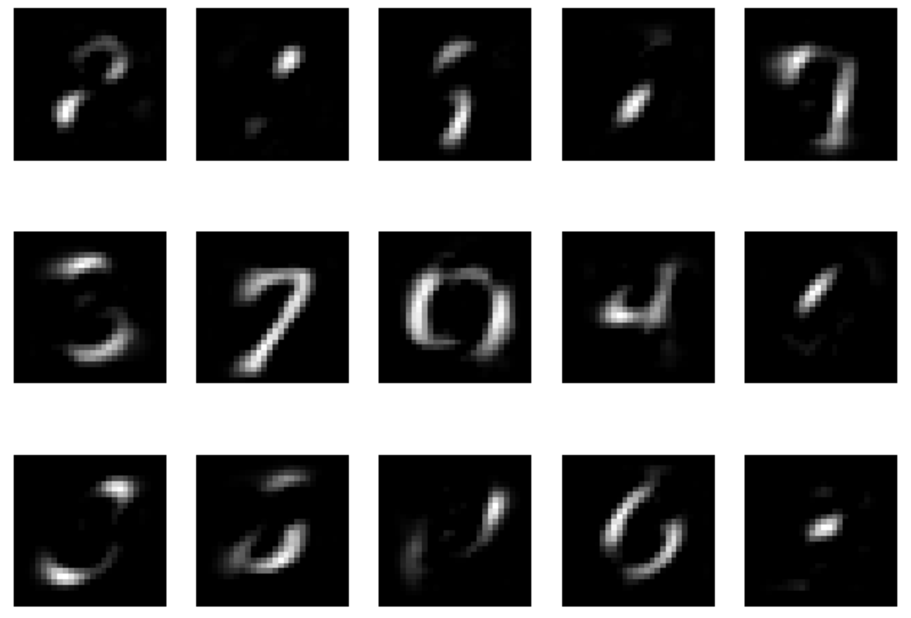 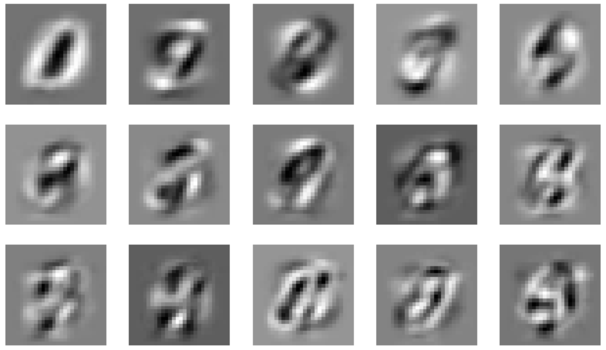
NMF (gauche), PCA (droite)

---

# Précisions sur l'update de W et H

## Concept de Base
- **Décomposition de NMF**: $V ≃ W * H$
- **Objectif**: Décomposer V (données) en W (coefficients) et H (composantes).
- **Initialisation**: Matrices W et H initialisées aléatoirement ou par NNV.

---

## Mise à Jour Alternée
### Mise à jour de $W$ et $H$

1. **Mise à Jour de W**:
   - Fixer H, optimiser W pour minimiser $| V - W * H |$.
   - Techniques optimales sous contrainte de non-négativité.

2. **Mise à Jour de H**:
   - Fixer W post-mise à jour, optimiser H pour minimiser la fonction de coût.
   - Utilisation de formules multiplicatives basées sur les gradients.

> Dans l'expérimentation on utilise plusieurs algorithmes de minimisation :
> Frobenius
> Kullback-Leibler

---

## Critères de Convergence
- **Alternance des mises à jour** jusqu'à convergence:
  - Changement minimal dans la fonction de coût ou
  - Nombre maximal d'itérations atteint.

## Implications Pratiques
- **Importance de l'initialisation**:
  - Influence significative sur la convergence et la qualité des composantes extraites.

---

# Processus de Reconstruction

- **NMF**: Utilisation pondérée des composantes.
- **PCA**: Reconstruction via projection sur les composantes principales.

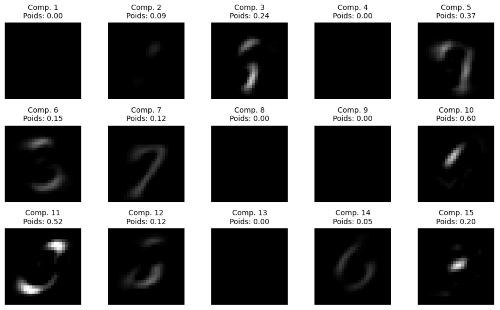
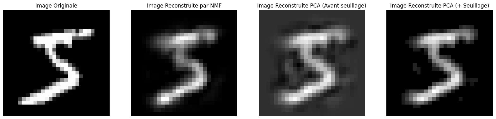

---

# Comparaison de Performances
Mean Squared Error (MSE) et temps d'exécution

- **Qualité de reconstruction**: Évaluation par MSE entre images reconstruites et originales.
- **Temps d'exécution**: Enregistrement pour différentes configurations.

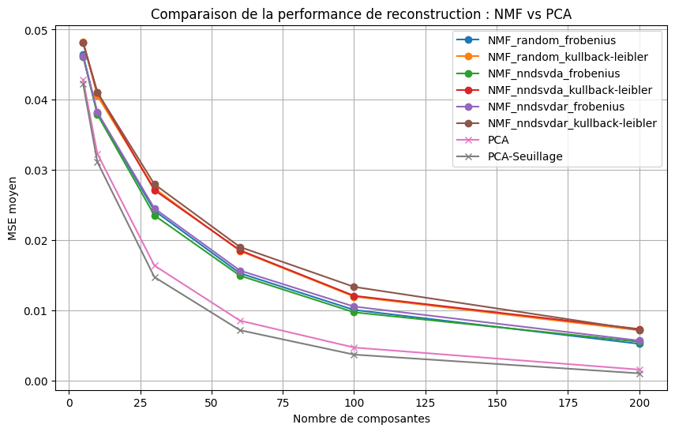 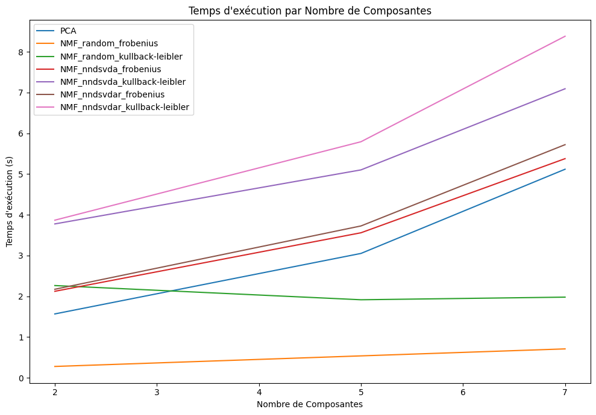

---

# Conclusion de l'exprimentation
### Implications et choix de méthodes

- **Interprétabilité**: NMF fournit des composantes plus interprétables.
- **Efficacité**: PCA est généralement plus rapide à cause de sa simplicité algorithmique.
- **Utilisation recommandée**: Dépend de l'objectif spécifique et des exigences de l'application.

---

## Application aux Données Textuelles

---

## Question générale

 - **Peut-on retouver, à l'aide d'une technique de réduction de dimension, des informations globales (thématiques, sujets de discussions) contenues dans des données textuelles ?**

 ---


## Démarche:

- **Représenter un ensemble de chaînes de caractères sous la forme d'une matrice (embedding)**
- **Appliquer la réduction de dimension**
- **Interpréter les composantes (nous avons connaissance à priori des thématiques traitées)**

---

## Dataset:
Données issues de `fetch_20newsgroups` cf TP "Classificaton de textes" en ML

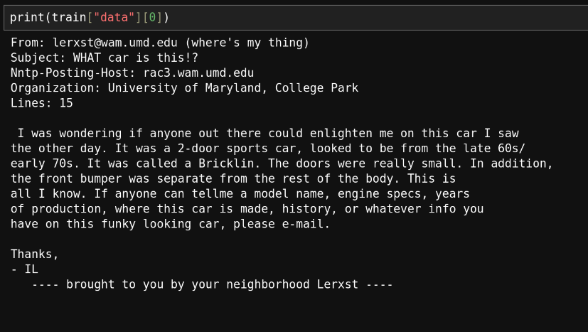

---
## Dataset après embedding:
Méthode choisie : TF-IDF (cf TP "Classificaton de textes" en ML)

- **Double-normalisation** :
  - _term-frequency_ : fréquence d'appartition de chaque mot dans une chaîne de caratère ("_la part des mots dans un texte qui sont le mot (ou n-gram) que la colonne représente_") (TP ML).

---

## Dataset après embedding:
Méthode choisie : TF-IDF (cf TP "Classificaton de textes" en ML)

- **Double-normalisation** :
  - _term-frequency_ : fréquence d'appartition de chaque mot dans une chaîne de caratère ("_la part des mots dans un texte qui sont le mot (ou n-gram) que la colonne représente_") (TP ML).
  - _inverse-document-frequency_ : fréquence d'appartion des mots dans le texte en général (les mots rare ont plus de poids)

---
## Dataset après embedding:

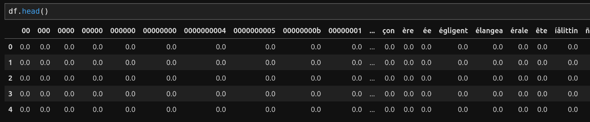

---
## Remarque:

Nous travaillerons ici sur deux catégories seulement :

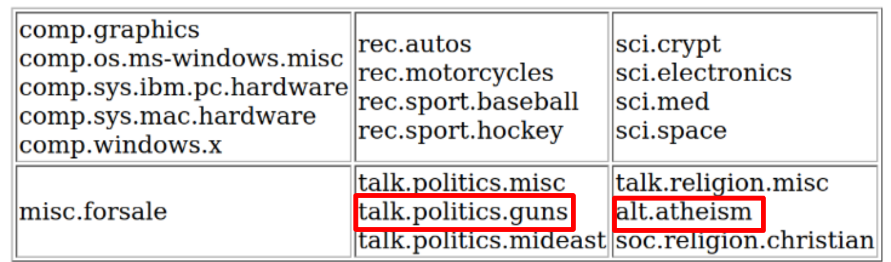

Au total : 1026 samples décrits par `23363` features.

---

## Comparaison NMF/PCA:

Métrique utilisée : l'erreur de reconstruction

Dit autrement : distance (ici "euclidienne") entre la matrice de base et celle reconstruite à partir des dimensions retenues.

On se limite à 20 dimensions du fait de notre puissance de calcul
 
---
## Comparaison NMF/PCA:

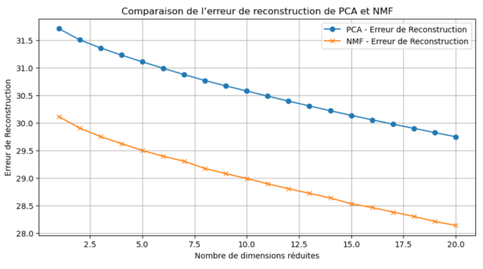

La NMF obtient de "meilleurs" résultats que la PCA. Cette analyse est cependant à relativiser.

---
## Limite:

Des méthodes adaptées à ce type de données ?

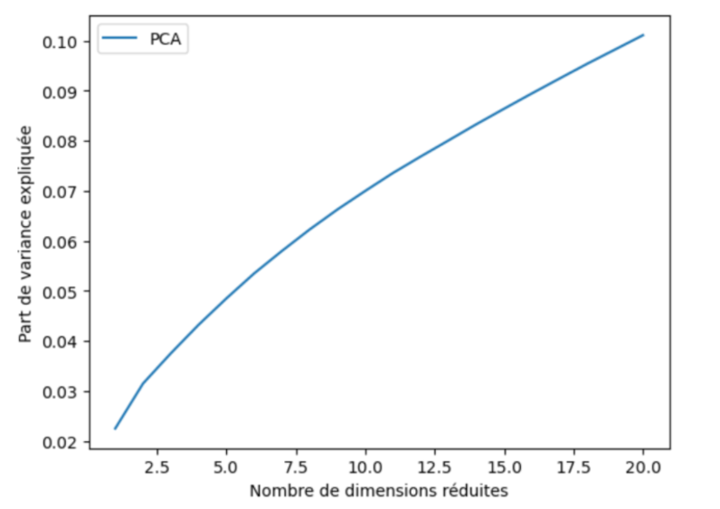

---
## Limite:

Des méthodes adaptées à ce type de données ?


**oui**: 10% de variance expliquée avec 20 dimensions.
Notre dataset comprenait 1026 samples décrits par `23363` features.
Avec 0.1% des features, on explique 10% de la variance.

---
## Limite:

Des méthodes adaptées à ce type de données ?


**non**: (dans le cas de notre démarche) car interprétation difficile (même si l'on s'appuit sur des corrélation, des dizaines de patterns seraient à étudier)

---

## Conclusion
- **Comparaison**:
  - Avantages de NMF en termes d'interprétabilité (images)
  - PCA plus adaptée pour une reconstruction rapide et précise
  - Proportion de significativité est explicite dans PCA, pas dans NMF (dimensions par nécessairement indépendantes)
- **Choix de la méthode**:
  - Dépend du contexte de l'application et du type de données
